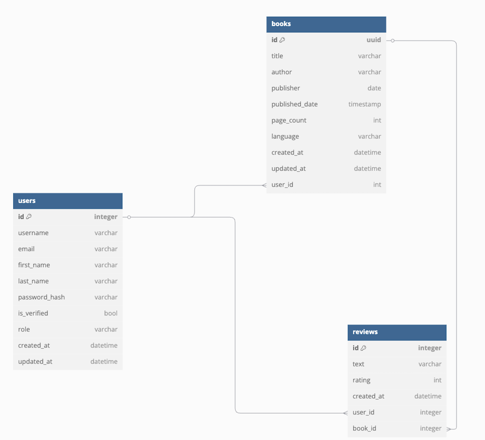

<h3 align="center">BookHive</h3>

<div align="center">
  
  
</div>

---

<p align="center">BookHive API
    <br> 
</p>

## 📝 Table of Contents
- [About](#about)
- [Getting Started](#getting-started)
- [Built Using](#built-using)

## 🧐 About <a name = "about"></a>
**BookHive** is an API for managing book records, allowing users to store, query, update, and delete books, as well as add and manage reviews. The application consists of three main modules:

- Book Module: Handles book-related operations, including listing, creating, updating, and deleting books.
- Review Module: Enables users to add book reviews.
- User Module: Manages user authentication and account actions such as sign-up, login, and logout.

The application uses **JWT** (JSON Web Tokens) for access control. Additionally, Redis is added to handle token revocation / user logouts.

### Database Schema
<div style="text-align: center;">
  
</div>

## 🏁 Getting Started <a name = "getting_started"></a>
These instructions will get you a copy of the project up and running on your local machine for development and testing purposes. 

### Prerequisites
 - [Docker](https://docs.docker.com/)
 - [Docker Compose](https://docs.docker.com/compose/)

### Installing
If you're opening this project using [devcontainers](https://containers.dev/) then your docker container should be ready to go!

Otherwise you will need to start the docker compose environment `docker compose up` and open a shell into the container `bookhive-dev`.

```bash
$ docker compose up
$ docker exec -it bookhive-dev /bin/bash   # spawns a shell within the docker container
$ pipenv shell  # spawns a shell within the virtualenv 
```


### ▶️ Running the webapp
```bash
# Load environments variables
$ source ./config/.env.example

# To run the server, you can use one of the following commands:
$ fastapi dev ./src/main.py --host 0.0.0.0    # Run the server in development mode
$ python cli.py run-webapp                    # Run the server using click
```

- [API Docs](http://0.0.0.0:8000/docs)
- [JSON version of OpenAPI documentation](http://0.0.0.0:8000/openapi.json)
- [Healthcheck endpoints](http://0.0.0.0:8000/health)


### Database Migrations

```bash
# init the migrations folder
$ alembic init -t async migrations  

# create a new migration version
$ alembic revision --autogenerate -m "message"  

# apply migrations
$ alembic upgrade head  

# fill tables with dummy data (existing data will be deleted).
# migrations has to be applied first
$ psql -U postgres -d bookhive -h bookhive-db -f init.sql   
```

*Note: If you're setting up this project, you only need to apply the existing migrations, as they have already been generated.*

### 🧪 Running the tests <a name = "tests"></a>
- [pytest](https://docs.pytest.org/) is used to run unit and integration tests.
- [schemathesis](https://schemathesis.readthedocs.io/en/stable/) is used for API testing.

```bash
# To run unit and integration tests
$ pytest

# The server has to be running to use Schemathesis.
$ st run http://0.0.0.0:8000/openapi.json --experimental=openapi-3.1
$ st run http://0.0.0.0:8000/openapi.json --checks all --experimental=openapi-3.1
```

### Code Style & Linting
- [ruff](https://docs.astral.sh/ruff/) is used as a linter and formatter.

```bash
$ ruff format                 # formatting only
$ ruff check . --fix          # formatting, imports, and unused variables
$ ruff check --select I --fix # sort imports
```

### Python Package Management
- [pipenv](https://pipenv.pypa.io/en/latest/) is used to manage Python packages. 

```bash
$ pipenv shell  # spawns a shell within the virtualenv
$ pipenv install  # installs all packages from Pipfile
$ pipenv install --dev # installs all packages from Pipfile, including dev dependencies
$ pipenv install <package1> <package2>  # installs provided packages and adds them to Pipfile
$ pipenv update  # update package versions in Pipfile.lock, this should be run frequently to keep packages up to date
$ pipenv uninstall package # uninstall a package 
$ pipenv uninstall package  --categories dev-packages # uninstall a dev package
```

## ⛏️ Built Using <a name = "built_using"></a>
- [FastAPI](https://fastapi.tiangolo.com/) - Web Framework.
- [PostgreSQL](https://www.postgresql.org/) - Database.
- [SQLModel](https://sqlmodel.tiangolo.com/) - ORM.
- [Redis](https://redis.io/) - In memory database.
- [Alembic](https://alembic.sqlalchemy.org/en/latest/) - Database Migration.